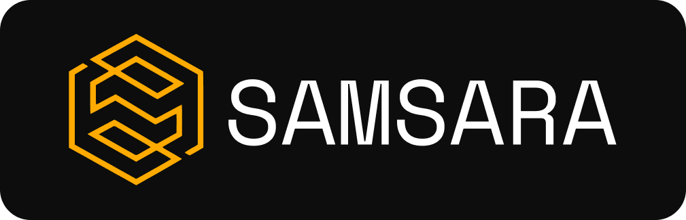
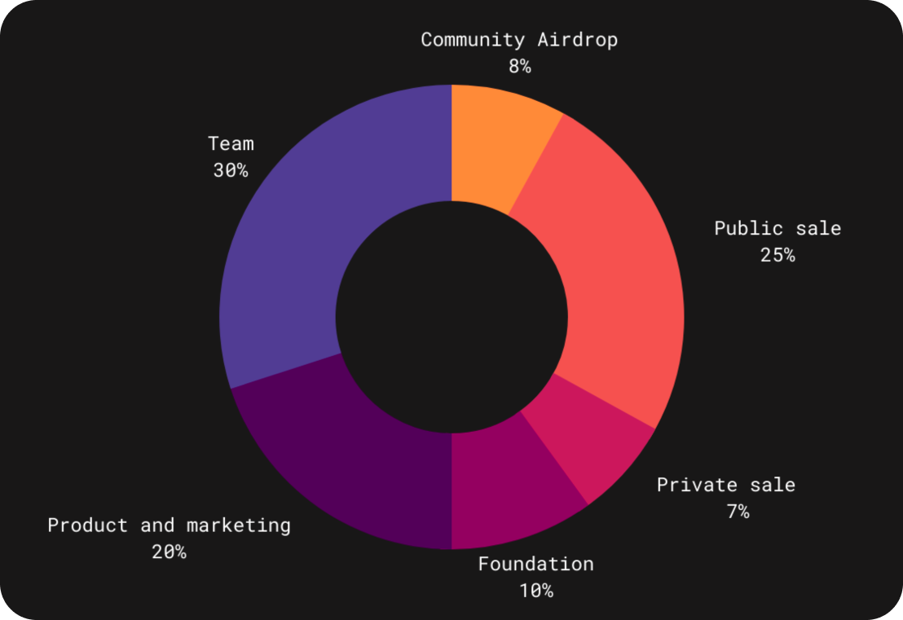

# Samsara SMRX

The life cycles are limited by karma

## What is Samsara?

Samsara - is the project which aims to create a digital person image and unique chat bot. Moreover, there will be the possibility of conversation by audio and video with chat bot. The digital image would be created by gathering and processing of personal data from online sources.

The gathering data for creation of digital image:
* the conversation with different users;
* music;
* set of interests;
* analysis of friends;
* activity in social networks;
* photos.

Information from the mobile application «Hello It’s me» by conversation with bot:
* information about installed applications;
* conversation by video (to reproduction of face image and facial expressions);
* conversation by audio messages (to reproduction of voice);
* access to photos and videos on the smartphone;
* browser history (to interests’ analysis).

Learn more about the project [here](https://smrx.io/samsara-wp.pdf).

### What makes Samsara unique?

Samsara token is supported by several components:
* Server power can be used on your own – for realization of a big project using artificial intelligence or creation of a digital person image;
* A certain amount of data storage that corresponds to all modern standards for secure data storage. If you use a token to create a digital profile, you can be sure that your personal data will remain safe;
* A digital space on a physical territory, which is located in one of the historical places of the Ulyanovsk region, which has several levels of security.

### How many Samsara tokens are there in circulation?

Total supply of SMRX tokens is 67 311 475 148.

42% of which will be circulating on the market (around 28,27 billion coins). 25% of the pool will be on Public Sale allocation. 7% of the pool will be on Private Sale allocation.

### Where can you buy Samsara?

You can buy SMRX on one of the most popular decentralized exchange [Uniswap](https://info.uniswap.org/#/tokens/0x7267711ba6d110e05da2b5ce663bec4a2f5ca910).

#### Related pages:

* Our [website](https://smrx.io/);
* See us on [Etherscan](https://etherscan.io/token/0x7267711ba6d110e05da2b5ce663bec4a2f5ca910);
* You can contact us by [Telegram](https://t.me/smrxcoin) or by [coin@smrx.io](mailto:coin@smrx.io).
